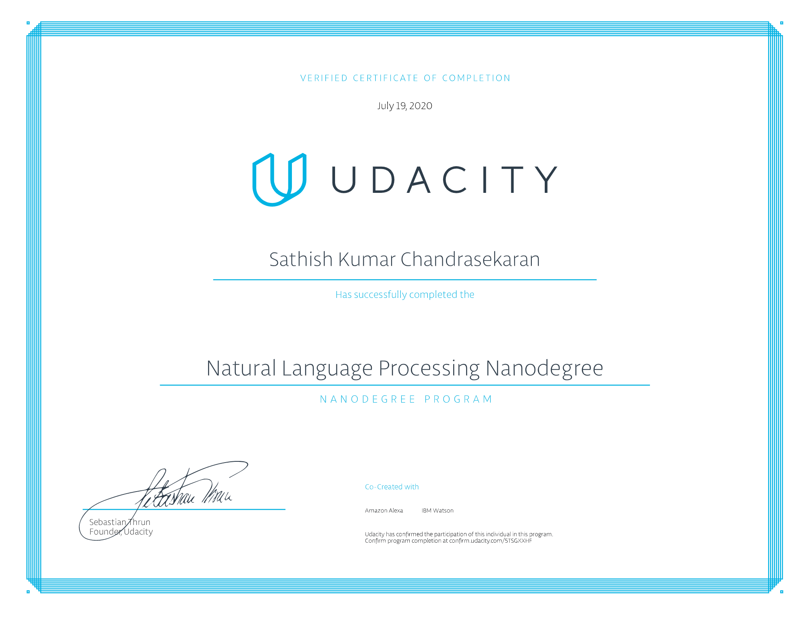

# Natural_Language_Processing-Projects
Projects done as part of NLP Nanodegree program from Udacity

# Projects of Natural Language Processing

1. Part-Of-Speech Tagger with Hidden Markov Model

2. Neural Machine Translation with Recurrent Neural Networks

3. End-to-end Automatic Speech Recognition with Convolutional Neural Networks and Recurrent Neural Networks

